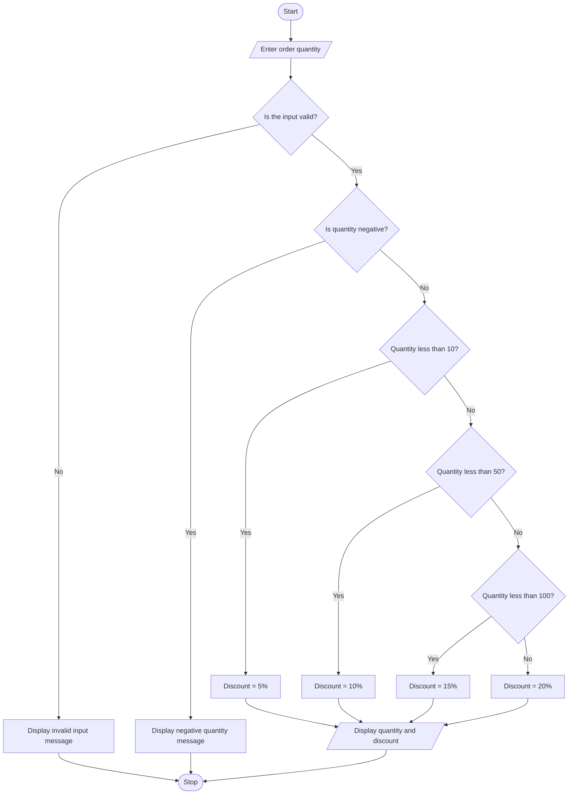

# Quantity Discount Calculator: Program Design

## Problem

Create a program that asks the user to enter an order quantity and
displays the discount percentage that applies.

## Objective

Determine the correct discount rate for an entered quantity.

## Input

The program receives:

- Order quantity

## Output

The program displays:

- Entered quantity
- Applicable discount percentage

## Operations

The program compares the quantity with a series of limits:

- A quantity below 10 receives a 5% discount
- A quantity below 50 receives a 10% discount
- A quantity below 100 receives a 15% discount
- A quantity of 100 or more receives a 20% discount

## Algorithm

1. Start
2. Ask the user to enter the quantity
3. Convert the entered value into an integer
4. Check that the quantity is not negative
5. If the quantity is less than 10, set the discount to 5%
6. Otherwise, if it is less than 50, set the discount to 10%
7. Otherwise, if it is less than 100, set the discount to 15%
8. Otherwise, set the discount to 20%
9. Display the quantity
10. Display the discount
11. Stop

## Pseudocode

```text
START

    DISPLAY "Enter the order quantity"
    INPUT quantity

    IF quantity is not a whole number THEN
        DISPLAY "Invalid input"
        STOP
    END IF

    IF quantity < 0 THEN
        DISPLAY "Quantity cannot be negative"
        STOP
    END IF

    IF quantity < 10 THEN
        discount = 5
    ELSE IF quantity < 50 THEN
        discount = 10
    ELSE IF quantity < 100 THEN
        discount = 15
    ELSE
        discount = 20
    END IF

    DISPLAY quantity
    DISPLAY discount

STOP
```

## Decision Table

| Condition or action | Rule 1 | Rule 2 | Rule 3 | Rule 4 |
|---|---:|---:|---:|---:|
| Quantity less than 10 | Yes | No | No | No |
| Quantity less than 50 | Yes | Yes | No | No |
| Quantity less than 100 | Yes | Yes | Yes | No |
| Discount | 5% | 10% | 15% | 20% |

## Flowchart



## Test Cases

| Quantity or input | Expected result |
|---:|---|
| 0 | 5% |
| 5 | 5% |
| 9 | 5% |
| 10 | 10% |
| 49 | 10% |
| 50 | 15% |
| 75 | 15% |
| 99 | 15% |
| 100 | 20% |
| 150 | 20% |
| -5 | Quantity cannot be negative |
| abc | Invalid input |

## Error Types to Consider

### Syntax Error

The code does not follow Python syntax.

### Runtime Error

The program encounters a problem while running, such as attempting
to convert non-numeric text into an integer.

### Logic Error

The program runs but uses incorrect conditions and produces the
wrong discount.
